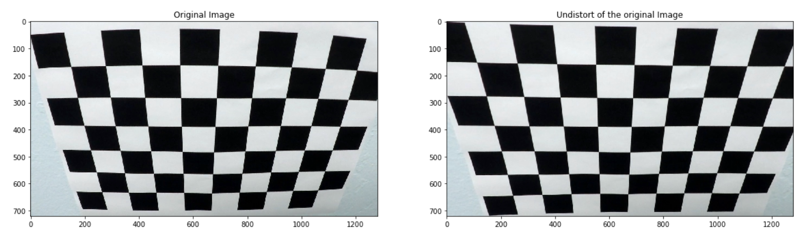
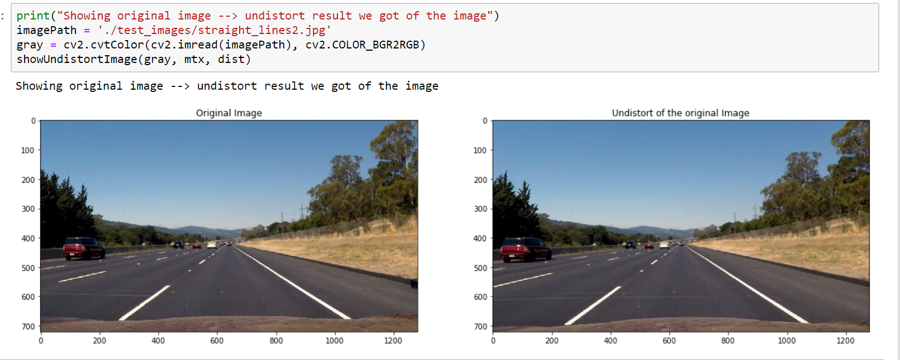
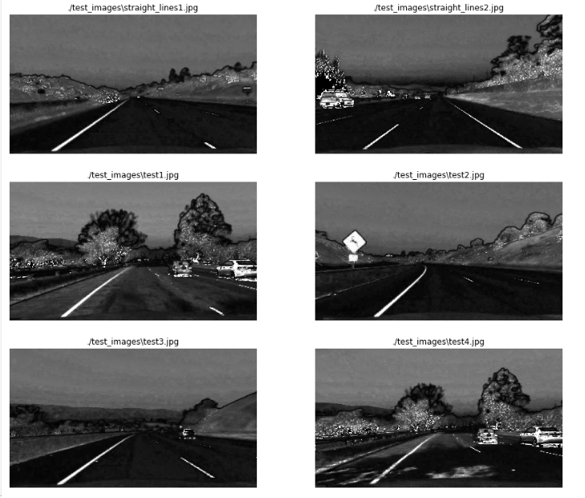
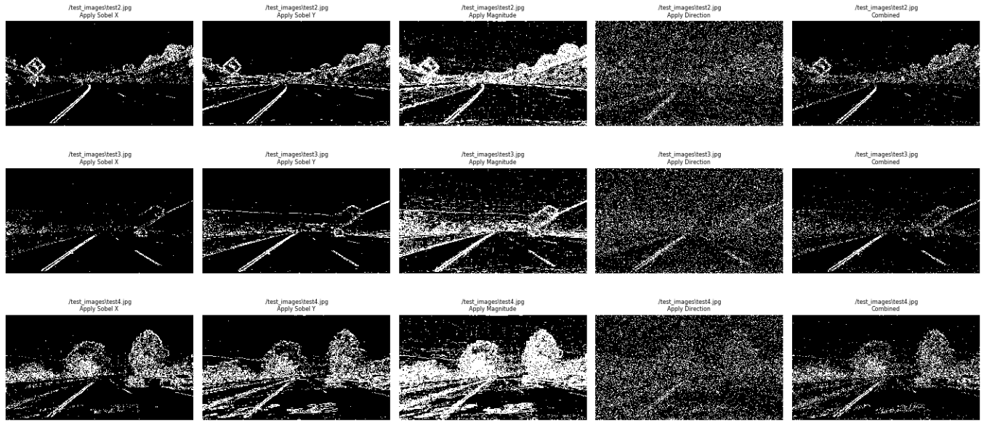
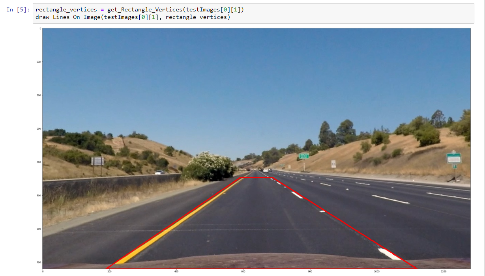
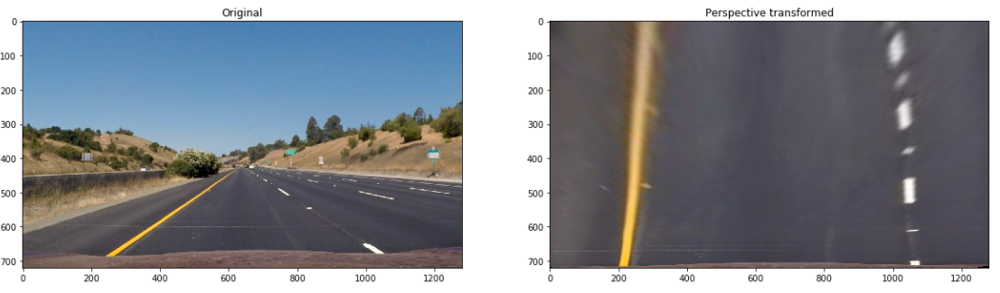
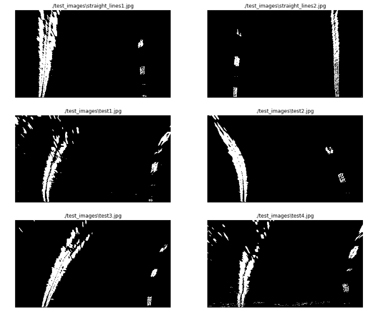
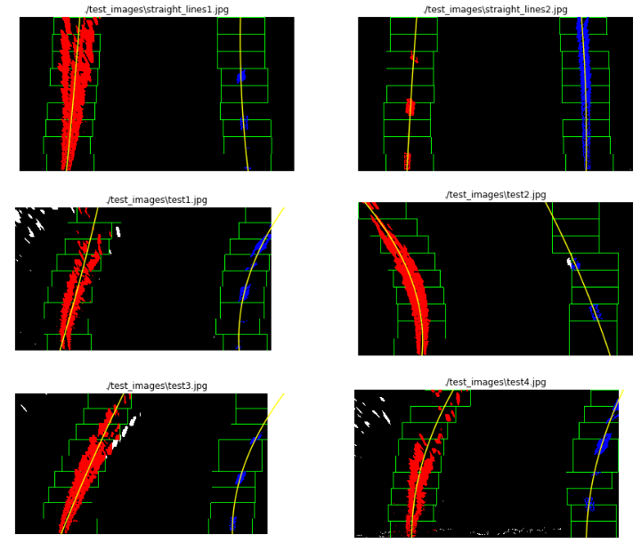
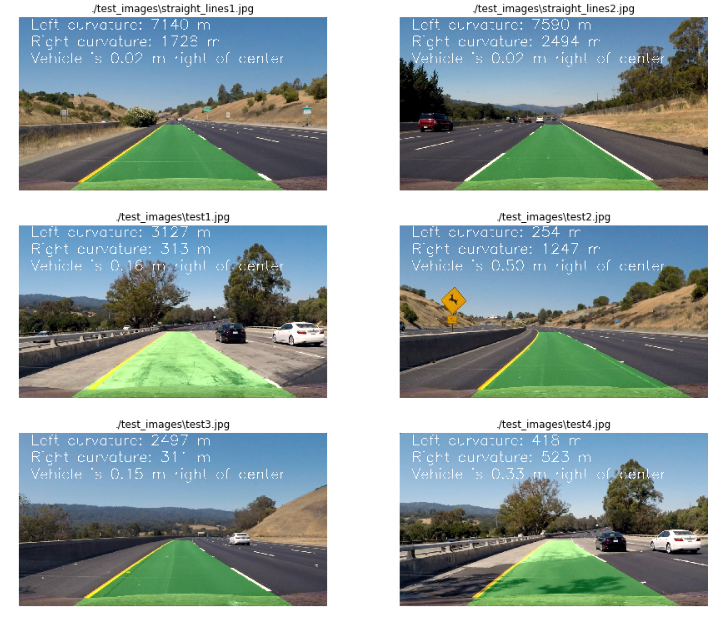

## Advanced Lane Finding
[](http://www.udacity.com/drive)


In this project, the goal was to write a software pipeline to identify the lane boundaries in a video.

The Project
---

The goals / steps of this project are the following:

* Compute the camera calibration matrix and distortion coefficients given a set of chessboard images.
* Apply a distortion correction to raw images.
* Use color transforms, gradients, etc., to create a thresholded binary image.
* Apply a perspective transform to rectify binary image ("birds-eye view").
* Detect lane pixels and fit to find the lane boundary.
* Determine the curvature of the lane and vehicle position with respect to center.
* Warp the detected lane boundaries back onto the original image.
* Output visual display of the lane boundaries and numerical estimation of lane curvature and vehicle position.

[//]: # (Image References)

[image1]: ./examples/undistort_output.png "Undistorted"
[image2]: ./test_images/test1.jpg "Road Transformed"
[image3]: ./examples/binary_combo_example.jpg "Binary Example"
[image4]: ./examples/warped_straight_lines.jpg "Warp Example"
[image5]: ./examples/color_fit_lines.jpg "Fit Visual"
[image6]: ./examples/example_output.jpg "Output"
[video1]: ./project_video.mp4 "Video"

## [Rubric](https://review.udacity.com/#!/rubrics/571/view) Points

### Here I will consider the rubric points individually and describe how I addressed each point in my implementation.  

---

### Camera Calibration

#### 1. This is a briefly state of how I computed the camera matrix and distortion coefficients. Provide an example of a distortion corrected calibration image

The camera calibration code for this step could be found on the [Step_1_Camera_Calibration notebook](Step_1_Camera_Calibration.ipynb).

I start by preparing "object points", which will be the (x, y, z) coordinates of the chessboard corners in the world. Here I am assuming the chessboard is fixed on the (x, y) plane at z=0, such that the object points are the same for each calibration image.  Thus, `objp` is just a replicated array of coordinates, and `objpoints` will be appended with a copy of it every time I successfully detect all chessboard corners in a test image.  `imgpoints` will be appended with the (x, y) pixel position of each of the corners in the image plane with each successful chessboard detection.  

I then used the output `objpoints` and `imgpoints` to compute the camera calibration and distortion coefficients using the `cv2.calibrateCamera()` function.  I applied this distortion correction to the test image using the `cv2.undistort()` function.

Using `cv2.findChessboardCorners`, the corners points are stored in an array `imgpoints` for each calibration image where the chessboard could be found. The object points will always be the same as the known coordinates of the chessboard with zero as 'z' coordinate because the chessboard is flat. The object points are stored in an array called `objpoints`. 

I then used the output objpoints and imgpoints to compute the camera calibration and distortion coefficients using the `cv2.calibrateCamera` function. I applied this distortion correction to the test image using the `cv2.undistort` function and obtained this result:



The camera calibration and distortion coefficients(mtx, dist) are stored using `pickle`(in folder ./pickled_data/camera_calibration.p) to be used on the main [notebook](Project.%20Advance%20Lane%20Lines.ipynb)

A short description of the images in [Step_1_Camera_Calibration notebook](Step_1_Camera_Calibration.ipynb) to compute the camera calibration matrix and distortion coefficients given a set of chessboard images:
```
readChessImages(): Load calibration images(chess boards in different angles from our camera_cal folder)
showImages(calibrationImages): Method for displaying the images
findingPoints(calibrationImages): Method for detecting the points in chess images (objpoints and imgpoints)
getCoefficients(objpoints, imgpoints, originalImage): Method for returning camera matrix, mtx, and the distortion coefficients dist

HOW TO USE THESE FUNCTIONS: 

# Read images
calibrationImages = readChessImages()
# Return object points and image points
objpoints, imgpoints, originalImages, outimages = findingPoints(calibrationImages)
# Save coefficients into pickle
originalImage = originalImages[10]

#Getting the coefficients we need for camera calibration
mtx,dist = getCoefficients(objpoints, imgpoints, originalImage)
```
### Pipeline (single images)
#### 1. Provide an example of a distortion-corrected image.
To demonstrate this step, I will describe how I apply the distortion correction to one of the test images like this one:



#### 2. Describe how (and identify where in your code) you used color transforms, gradients or other methods to create a thresholded binary image.  Provide an example of a binary image result.

The code used to experiment with color, gradients, and thresholds could be found on the [Step 2. Color Transform and Gradients Threshold notebook](Step_2_Color_Transform_and_Gradients_Threshold.ipynb).

A color transformation to HLS was done, and the S channel was selected because it shows more contracts on the lane lines. Here are the results for all the testing images:


Next step was to calculte the gradients:
- Sobel X and Sobel Y: `In [7]` and `In [8]`
- Magnitude : `In [10]`
- Gradient direction : `In [12]`
- Combination of all the above (Sobel X and Sobel Y) or (Magnitude and Gradient): `In [13]`

After applying thresholds here are the results:


We can observe that the combination of these gradients leads to a "noisy" binary images. For this reason, on the main project, presented in the [Project. Advance Lane Lines notebook](Project.%20Advance%20Lane%20Lines.ipynb) notebook, only the combination of `Sobel X` and `Sobel Y` was used to continue with the pipeline. 

#### 3. Describe how (and identify where in your code) you performed a perspective transform and provide an example of a transformed image.

The perspective transformation code could be found on [Step_3 Apply Perspective transformation notebook(Step_3_Apply_Perspective_transformation.ipynb). 

Four points where selected on the first image as the source of the perspective transformation. Those points are highlighted on the following image:


How we draw the vertices can be found in the method `get_Rectangle_Vertices(image)` in `In [4]`:
```
imgHeight = int(image.shape[0])
imgWidth = int(image.shape[1])

vertice_1 = (190, imgHeight)
vertice_2 = (int(imgWidth/2 - imgWidth*.038), int(imgHeight/2 + imgHeight*.08 + 30))
vertice_3 = (int(imgWidth/2 + imgWidth*.038), int(imgHeight/2 + imgHeight*.08 + 30))
vertice_4 = (imgWidth-160, imgHeight)
vertices = (vertice_1, vertice_2, vertice_3, vertice_4)
```
Using `cv2.getPerspectiveTransform`, a transformation matrix was calculated, and an inverse transformation matrix was also calculated to map the points back to the original space (In [6]). The result of the transformation on a test image is the following:


The transformation matrix and the inverse transformation matrix was stored using `pickle` to be used on the main project. The following picture shows the binary images results after the perspective transformation:



#### 4. Describe how (and identify where in your code) you identified lane-line pixels and fit their positions with a polynomial?

The line detection code could be found at `In [9]` of the main project. 
The algorithm calculates the histogram on the X axis.
Finds the picks on the right and left side of the image, and collect the non-zero points contained on those windows.
When all the points are collected, a polynomial fit is used (using `np.polyfit`) to find the line model.
On the same code, another polynomial fit is done on the same points transforming pixels to meters to be used later on the curvature calculation. 
The following picture shows the points found on each window, the windows and the polynomials:


#### 5. Describe how (and identify where in your code) you calculated the radius of curvature of the lane and the position of the vehicle on the center.

On the step 4 a polynomial was calculated on the meters space to be used here to calculate the curvature. The formula is the following:

```
((1 + (2*fit[0]*yRange*ym_per_pix + fit[1])**2)**1.5) / np.absolute(2*fit[0])
```

where `fit` is the the array containing the polynomial, `yRange` is the max Y value and `ym_per_pix` is the meter per pixel value.

To find the vehicle position on the center:

- Calculate the lane center by evaluating the left and right polynomials at the maximum Y and find the middle point.
- Calculate the vehicle center transforming the center of the image from pixels to meters.
- The sign between the distance between the lane center and the vehicle center gives if the vehicle is on to the left or the right.

The code used to calculate this could be found at `In [18]`.
#### 6. Provide an example image of your result plotted back down onto the road such that the lane area is identified clearly.
To display the lane lines on the image, the polynomials where evaluated on a lineal space of the Y coordinates. 
The generated points where mapped back to the image space using the inverse transformation matrix generated by the perspective transformation. The following images are examples of this mapping:


### Pipeline (video)

#### 1. Provide a link to your final video output. Your pipeline should perform reasonably well on the entire project video (wobbly lines are ok but no catastrophic failures that would cause the car to drive off the road!).
The project video was processed and the results at [video_output](./video_output/project_video.mp4)

#### Youtube video
[](https://www.youtube.com/watch?v=SOz1fBzZn1A)

### Discussion

#### 1. Briefly, discuss any problems/issues you faced in your implementation of this project. Where will your pipeline likely fail? What could you do to make it more robust?

Problems:
- repetitive calculation

Few improvements: 
- we can use other gradients, for example Laplacian to improve the line detection;
- frame to frame to improve robustness of the process

Articles to research for improvements:
https://arxiv.org/abs/1706.08442
https://towardsdatascience.com/lane-detection-with-deep-learning-part-1-9e096f3320b7
https://towardsdatascience.com/lane-detection-with-deep-learning-part-2-3ba559b5c5af
https://arxiv.org/abs/1710.06288
https://arxiv.org/abs/1605.06211
http://www.cvlibs.net/datasets/kitti/eval_road.php


